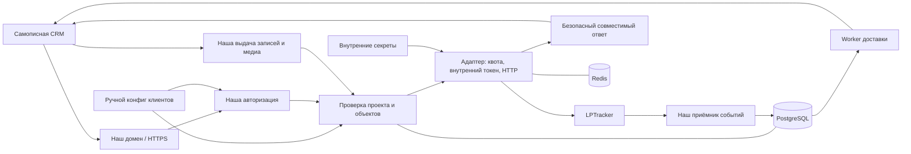

# ProxyAPI: план реализации для разработчиков

Дата: 22.09.2026. Версия: 1.1, с учётом уточнений заказчика. Статус: план реализации; проверки на авторизованном API ещё предстоят.

Основной документ для передачи команде. Приложения: [задачи и точки приёмки](proxy-api-tasks.md), [реестр методов](proxy-api-endpoint-inventory.md) и [пример клиентского конфига](../examples/clients.example.yaml). Исходный материал — `lptracker_api_proxy_vision.md`, версия 1.0; уточнения заказчика имеют приоритет над вариантами из vision. В рабочей папке исходного кода нет: это новый сервис.

**Уверенность:** высокая в зафиксированных требованиях и приведённых фактах документации; средняя в реализуемости полной совместимости до проверки спорных методов; низкая в предварительной оценке сроков. Реальные запросы с credentials LPTracker, нагрузочные испытания и интеграция с CRM при подготовке плана не выполнялись. Архитектурные решения ниже — предложения для реализации, а не свойства уже существующего сервиса.

## 1. Зафиксированная задача

Разработать промежуточный сервис между самописной CRM клиента и LPTracker. Требуется поддержка **всего публично документированного API на зафиксированную дату**, а не только контактов и лидов. Каждый клиент получает собственные credentials ProxyAPI и работает ровно с одним проектом LPTracker, указанным администратором в отдельном конфиг-файле.

Требования заказчика:

- Данные аккаунта, пароль и токены LPTracker находятся внутри нового сервиса и недоступны клиенту.
- Авторизация клиента выполняется в ProxyAPI; его login/password/token не пересылаются в LPTracker.
- Клиентские credentials создаются вручную и передаются клиенту. Регистрация, кабинет и биллинг не нужны.
- Соответствие «клиент → проект LPTracker» задаётся вручную в конфиг-файле. Клиент не может выбрать другой проект.
- Клиент не получает список остальных проектов и не обращается к их данным через ID, связанные объекты, сотрудников, файлы или события.
- Полный объём включает удаления, задачи, метки, файлы, звонки, сообщения, настройки и вебхуки.

В [реестре](proxy-api-endpoint-inventory.md) найдено **64 операции**. Это предварительный снимок документации, который команда актуализирует на этапе 0. Новые версии API требуют управляемого обновления; неизвестные пути нельзя автоматически пропускать к поставщику. Внутренние API веб-интерфейса LPTracker не считаются публичным API без отдельного подтверждения.

**Ограничение цели, уверенность высокая:** API, повторяющий методы и модели LPTracker, можно опознать по контракту. Сервис может скрыть прямые технические признаки, адреса, секреты и доступ к поставщику; гарантировать невозможность догадаться о поставщике при сохранении совместимости нельзя. Для строгой неузнаваемости нужен собственный контракт API и переработка клиента. В этом плане принята совместимость с защитой служебных данных.

Готовность означает проверенную реализацию всех строк согласованного реестра. Временный безопасный отказ на сложном методе защищает данные, но не считается выполнением требования «весь API». Этапы ниже — порядок поставки возможностей, а не сокращение конечного объёма.

## 2. Факты, которые влияют на архитектуру

| Подтверждено документацией | Что делать разработчикам |
|---|---|
| В справке указан `direct.lptracker.ru`, в постановке упомянут `api.lptracker.ru`. [Справка](https://docs.direct.lptracker.ru/common/common/) | На этапе 0 подтвердить рабочий endpoint. Кандидат — `https://direct.lptracker.ru`; не предполагать эквивалентность адресов |
| Прикладная ошибка может возвращаться с HTTP 200. [Справка](https://docs.direct.lptracker.ru/common/common/) | Проверять HTTP-статус и `status/errors` в теле |
| Предел — 3 запроса в секунду, ошибка превышения — 503; область квоты не указана. [Ошибки](https://docs.direct.lptracker.ru/common/errors/) | Уточнить, считается ли лимит по IP, аккаунту или токену. Ограничивать также предварительные проверки, login и повторы |
| Вход — `POST /login`, четыре поля, токен — заголовок `token`; есть logout. [Авторизация](https://docs.direct.lptracker.ru/basic/auth/) | Совместимую внешнюю форму обслуживать локально; к поставщику входить отдельно |
| Указаны 24 часа бездействия токена и один пользователь LPTracker на IP; несколько сервисов допускаются. [Авторизация](https://docs.direct.lptracker.ru/basic/auth/) | Проверить обновление токена и IP-поведение. Для одного общего аккаунта начать с закреплённого исходящего IP; второй аккаунт не подключать без проверки |
| Ответ отдельного contact detail содержит ID, тип и значение, без project_id и родительского контакта. [Контактные данные](https://docs.direct.lptracker.ru/contact/detail_get/) | Нужен доказанный способ установить принадлежность detail; одной проверки ответа недостаточно |
| `GET /staff` не принимает project_id. [Сотрудники](https://docs.direct.lptracker.ru/staff/list/) | Нельзя отдавать весь ответ общего аккаунта; нужен разрешённый состав сотрудников клиента |
| Задачи содержат project_id, owner, observers, labels, настройки видимости и уведомлений. [Создание задачи](https://docs.direct.lptracker.ru/task/create/) | Проверять вложенные ссылки и побочные уведомления, не только проект задачи |
| Вызов лида и `callback` при создании могут инициировать звонок. [Вызов](https://docs.direct.lptracker.ru/lead/call/), [создание](https://docs.direct.lptracker.ru/lead/create/) | Не повторять автоматически; тестировать на выделенном номере |
| Список звонков и webhook содержат ссылки на записи. [Звонки](https://docs.direct.lptracker.ru/lead/calls_list/), [события](https://docs.direct.lptracker.ru/common/webhook/) | Нужна собственная защищённая выдача медиа, иначе поставщик раскрывается |

Не считать документацию полностью согласованной: есть расхождения `field/fields`, `field/details` и `detail/details`, названий полей метки, оболочек списков. Точные спорные места помечены в реестре. Проверять их на синтетических данных заранее; нельзя пробовать альтернативный URL записи после неясного ответа первого запроса.

## 3. Рекомендуемая архитектура

Один backend с разделёнными модулями, одна PostgreSQL, Redis и worker для доставки событий. Не создавать отдельные микросервисы для login, маршрутизации и токенов. Это уменьшает число мест, где средняя по опыту команда может ошибиться в изоляции.

**Предлагаемый стек:** Python/FastAPI, HTTPX, PostgreSQL, Redis, Alembic, pytest, Docker. Версии закрепить на старте в поддерживаемых ветках. Если команда лучше знает другой backend-стек, заменить его с сохранением контракта и проверок. Kafka, Kubernetes и отдельный API-management продукт из текущей задачи не следуют.

Минимальные обязанности модулей:

| Модуль | Ответственность |
|---|---|
| `config/` | Чтение и проверка YAML, версия конфигурации, атомарное применение |
| `auth/` | Только наши credentials, сессии, отзыв и ограничения входа |
| `access/` | Разрешённый проект, принадлежность объектов и вложенных ссылок |
| `routes/` | Явные обработчики всех методов реестра |
| `provider/` | Адрес поставщика, его секреты/токены, квота, HTTP, timeout |
| `compatibility/` | Схемы ответа, безопасные ошибки, заголовки, ссылки |
| `operations/` | Идемпотентность и неопределённый результат записей |
| `webhooks/`, `media/` | Relay событий и собственная выдача файлов/записей |
| `admin/`, `observability/` | Закрытые служебные команды, аудит, метрики |

Создать эти модули под `src/proxy_api/`, тесты под `tests/`, миграции под `migrations/`, публичный контракт под `docs/api/`, инструкции под `docs/runbooks/`. Это предлагаемые будущие пути, а не существующий код.

База хранит только рабочее состояние: сессии и отзыв, индекс принадлежности объектов, попытки операций, webhook-подписки/события/доставки, аудит и версию применённого конфига. **Источник соответствия клиента и проекта — YAML**, а не независимо редактируемая таблица в БД. Полное зеркало CRM-данных не требуется.

## 4. Ручной конфиг и выдача credentials

Формат показан в [clients.example.yaml](../examples/clients.example.yaml). Один клиент имеет один login, hash пароля, статус, ссылку на внутренний аккаунт и один project_id. Исходная трактовка — несколько клиентов в разных проектах одного аккаунта. Несколько независимых клиентов в одном проекте не разрешать молча: они получат общий доступ к проекту. Несколько логинов одной организации допустимы при явном объединении в одну границу доступа.

Клиент знает только наш адрес, свои login/password и контракт. Публичный токен он получает у нас. Пароль LPTracker хранить отдельно от клиентского конфига в серверном secret file с ограниченными правами либо secret manager; не хранить секреты в Git, образе контейнера и открытых backup. В клиентском YAML — hash пароля, например Argon2id через готовую библиотеку.

Ручное подключение:

1. Администратор определяет проект и разрешённых сотрудников, проверяет их в тестовом/рабочем аккаунте.
2. Локальная административная утилита генерирует стойкий пароль и его hash; пароль показывается один раз. Доступна и генерация hash для пароля, выбранного администратором. Секрет не передавать параметром CLI и не писать в shell history.
3. Администратор добавляет запись в YAML, запускает валидацию и применяет новую ревизию.
4. Клиенту передаются наш URL, login и пароль по согласованному защищённому каналу. Сам YAML, внутренний аккаунт и список других клиентов не передаются.
5. Проверяется login и `GET /projects`: ровно один проект.

Обязательная валидация: схема YAML, неизвестные ключи, дубли ключей/login, тип ID, существование ссылки на аккаунт, валидный hash, назначение одного проекта независимым клиентам. При запуске с неправильным конфигом сервис не готов к трафику; при неуспешном обновлении остаётся предыдущая целиком валидная версия.

Применение атомарное: все процессы используют одну активную ревизию; экземпляр с иной ревизией не допускается к обработке запросов. Для небольшого запуска допустимо краткое техническое окно с согласованным перезапуском. Хранить hash/номер активной ревизии и показывать их только в закрытой диагностике. Каждый запрос использует единый снимок политики; перед отправкой после ожидания квоты проверяет, что права ещё действуют.

Смена пароля, отключение клиента или смена его проекта отзывает связанные сессии. При смене проекта сначала блокировать клиента, завершить активные операции, отозвать сессии, очистить зависимые кэши/старые выдачи, затем применить новое назначение. Не давать активному токену незаметно получить другой проект. Процедура отката конфига не должна восстанавливать отозванные пароли/сессии автоматически.

## 5. Два независимых контура авторизации

**Публичный:** поддержать `POST /login` с совместимыми `login/password/service/version`, проверять наши credentials, возвращать собственный случайный token в совместимой оболочке. `service` клиента можно хранить как безопасную метку клиента, но оно не выбирает внутренние credentials и не пересылается в login LPTracker. Наш token передаётся в заголовке `token`; в хранилище — его hash. `POST /logout` отзывает только нашу сессию.

Предлагаемая политика — 24 часа бездействия сессии; закрепить её явно в клиентском контракте. Отзыв проверяется при каждом новом запросе на всех процессах. Не рассчитывать только на срок долгоживущего JWT. Уже отправленную внешнюю запись отзыв credentials отменить не может.

**Внутренний:** наш backend входит с серверными credentials и фиксированным внутренним `service`. Token manager хранит токен в закрытом хранилище, координирует refresh по аккаунту между процессами и не допускает перезаписи нового токена результатом старого refresh. У блокировки есть срок, ожидание ограничено. Redis с plaintext-токенами и дампами тоже является хранилищем секретов и должен быть защищён.

При внутреннем 401 обновить токен и повторить безопасное чтение не более одного раза. Для записи — повтор после 401 только при доказанной гарантии невыполнения; иначе по умолчанию без повтора. Неверный пароль LPTracker — техническая ошибка сервиса для клиента, а не сообщение о неверности его credentials. Ограничить попытки refresh, сигнализировать эксплуатации.

Начать с одного аккаунта и фиксированного egress. Если потребуются несколько аккаунтов, подтвердить IP-ограничение и согласованную схему отдельных исходящих адресов. Последовательный перелогин разных аккаунтов с одного IP нельзя считать решением без доказательства отсутствия взаимной инвалидизации.

## 6. Проверка проекта для каждого метода

Правило: клиентское значение ID никогда не является доказательством доступа. У запроса есть контекст `{client_id, provider_account, allowed_project_id, config_revision}` из серверного конфига. Сохранить настоящие ID разрешённого проекта и объектов — отдельная виртуальная нумерация не нужна для заявленной задачи.

1. Зарегистрировать все маршруты явно. Неизвестный метод не вызывает поставщика. Нормализовать путь и query, отклонять неоднозначные повторения project_id и конфликтующие значения во вложенных данных.
2. Если проект есть в URL/query/body, он обязан совпасть с конфигом. Не подменять чужой ID молча. Необязательный project_id можно подставлять из конфига только по явно описанному контракту; чужое переданное значение всегда отклоняется.
3. `GET /projects` возвращает один разрешённый проект, без чужих ID, названий и общего счётчика. По возможности получать его проектным методом вместо полной выборки аккаунта.
4. Чтение контакта, лида, просмотра и задачи по ID: получить объект внутренне, установить проект, затем разрешить выдачу. Изменение/удаление: доказать принадлежность **до** изменяющего запроса. При неопределённости — отказ.
5. Проверять связанные контакты, просмотры, шаги, custom-поля, сотрудников, наблюдателей, метки и файлы. Проверять обе альтернативы: переданный ID и вложенный создаваемый объект. Нельзя обойти правило через `custom`, массив или значение owner.
6. Списки запрашивать в одном проекте и проверять их содержимое. Неожиданный чужой объект — безопасная ошибка ответа и закрытая диагностика. Фильтрация и пагинация не должны раскрывать общий объём других проектов.
7. Для foreign/not-found ID использовать одинаковую публичную ошибку по нашему контракту. Время обработки и перебор ограничивать отдельно; не обещать идеальную неразличимость по времени.

Особые случаи, которые надо реализовать до приёмки всего API:

| Случай | Обязательная реализация |
|---|---|
| `contact/details/{id}` без родителя | Индекс `account + detail_id → contact_id + project_id`, заполненный только из проверенных контактов. Перед записью перечитать родителя и убедиться, что detail всё ещё входит в него. Клиент не может сам создать запись индекса |
| Уже существующие contact details | На этапе 0 доказать полный bootstrap и актуализацию индекса. Есть противоречие: [SDK](https://docs.direct.lptracker.ru/phpsdk/methods/) говорит о поиске всех контактов без фильтра, а [HTTP-описание](https://docs.direct.lptracker.ru/contact/search/) требует фильтр. Если перечисление невозможно, получить проверяемый экспорт/способ lookup от поставщика или изменить контракт клиента. Скрыто требовать предварительный GET контакта нельзя: это неполная совместимость |
| Метка без project_id в пути | Проверить ID по полной проектной выборке меток; при изменении не опираться на устаревший положительный кэш |
| `GET /staff`, owner/observers | Использовать доказанное членство сотрудников в проекте; если API его не предоставляет — ручной `allowed_staff_ids` в конфиге. Это касается и вложенных сотрудников, и назначения владельца, и получателей уведомлений |
| Главный аккаунт, owner=0 | Сохранить допустимую бизнес-операцию назначения, но отдавать согласованное нейтральное представление владельца проекта; не раскрывать логин/email/профиль служебного аккаунта. Идентификаторы/типы сохранять по проверенному контракту |
| Задачи с visibility/уведомлениями | Проверить фактическую область «все сотрудники», observer и уведомления. Она не должна открывать данные других клиентов или отправлять им уведомления. Если это нельзя обеспечить при общем аккаунте, необходимы отдельные аккаунты либо согласованное изменение семантики; это блокер полной совместимости |
| `last_project_id`, avatar и вложенные профили | Убирать/заменять ссылки на чужие проекты и служебную инфраструктуру по правилам схемы; не пропускать сырой объект сотрудника |

Индекс принадлежности не является полным зеркалом CRM. Хранить ID, доказанную связь, источник/время проверки и служебный статус. Положительную запись повторно проверять перед опасным действием. Ключи кэша, индекса и идемпотентности включают аккаунт, клиента/проект, тип и ID объекта.

Проверка до изменения имеет гонку, если объект можно перенести в другой проект между чтением и записью. Запретить перенос между клиентскими проектами при активных интеграциях и проверить ограничения прав поставщика. Если перенос невозможно контролировать, нужна изоляция правами отдельных аккаунтов или другой подтверждённый механизм. Один предварительный GET не доказывает атомарную изоляцию.

## 7. Полный API и скрытие служебных данных

[Реестр методов](proxy-api-endpoint-inventory.md) — основа `docs/api/compatibility-matrix.md`. На каждый метод описать схему запроса/ответа, права, поля с ID/URL, побочные эффекты, ошибки, число внешних вызовов, повторы, особенности и тесты. Поддержать все документированные поля после проверки; не оставлять произвольный постоянный запрет payments, owner, callback или файлов, выдавая его за полный API.

Сохранять типы, формат дат, фильтры/сортировку, null, пустые значения, отсутствие поля и семантику очистки. Проверить оболочки списков отдельно. Схемы должны учитывать динамические пользовательские поля: нельзя потерять законные ключи `custom`/`fields` из-за слишком узкой статической модели.

Правила публичного ответа:

- Прикладные ошибки: совместимая оболочка, обычно HTTP 200, `status=error`, `errors[]`. Внешний 401 не становится публичным 401, если наши credentials корректны.
- Свои отказы доступа, лимита, upstream timeout и «результат записи неизвестен» получают заранее зафиксированные коды и нейтральные сообщения. Отличия от поставщика открыто документируются для самописной CRM.
- Не пропускать сырой HTML, stack trace, текст исключения, server banners, cookies, Location и диагностические заголовки. Разрешённые заголовки формирует наш сервис.
- Не следовать внешним redirect автоматически. Upstream host берётся из серверной конфигурации; входящие Host/Authorization/token и служебные заголовки не пересылаются как есть.
- Системные URL в JSON, webhook и файлах-медиа переписываются на реально работающие собственные маршруты. Нельзя просто заменить домен строкой без реализации выдачи.
- Клиентские документы, схемы, примеры и страницы ошибок — под нашим брендом. Внутренние материалы команды могут называть LPTracker.
- Произвольный текст, введённый людьми, и содержимое загруженных ими файлов могут сами упоминать LPTracker. Автоматически редактировать бизнес-контент не требуется; гарантия относится к служебным данным, создаваемым интеграцией.

Неизвестный формат ответа не пропускается автоматически. Команда получает уведомление о дрейфе API; клиент — безопасную ошибку, если обязательный результат невозможно сформировать. Это повод обновить контракт и тесты.

## 8. Файлы, звонки и собственная выдача медиа

Загрузка/получение файла лида документированы через JSON/Base64. Сохранить этот формат, проверить всю цепочку `проект → лид → поле → файл`, имя, MIME, максимальный размер encoded/decoded payload и потребление памяти. Вложения входящих сообщений проходят те же проверки. [Загрузка](https://docs.direct.lptracker.ru/lead/file_upload/), [получение](https://docs.direct.lptracker.ru/lead/file_get/)

Для `record` в списке звонков и webhook реализовать наш media endpoint. Клиент передаёт наш токен либо получает короткоживущую подписанную ссылку, если проигрыватель не умеет заголовок. Ссылка привязана к клиенту, проекту, записи и сроку; при каждом получении проверяются актуальность прав и отзыв. В URL нет исходного адреса или credentials LPTracker. Не логировать подписанную строку.

Сервис самостоятельно получает запись из разрешённого источника, отдаёт байты через наш домен, поддерживает нужные CRM Range/Content-Type/Content-Disposition и очищает заголовки. Не делать redirect браузера на `sound.lptracker.ru`. Разрешённые хосты поставщика фиксируются после проверки реальных ответов; защита от SSRF и redirect действует и здесь. Ограничить одновременные скачивания и объём. Нельзя принимать от клиента произвольный URL для скачивания.

Звонки, платежи, комментарии, сообщения, загрузки и изменения автоворонок — операции с побочными эффектами. Не повторять их автоматически при timeout. На интеграционных тестах использовать только синтетические записи, согласованный тестовый номер и настройки без уведомления реальных людей.

## 9. Вебхуки входят в итоговый объём

Поток: **LPTracker → наш receiver → надёжно сохранённое событие/задание → наш worker → CRM**. Операции `GET/PUT callback-url` и `GET/PUT project-callback-url` управляют локальными настройками клиента. В LPTracker регистрируется только наш receiver. Публичный GET показывает подписки клиента, а не внутренний URL и чужие интеграции. [Лиды](https://docs.direct.lptracker.ru/project/callback_url/), [CRM](https://docs.direct.lptracker.ru/project/project_callback_url/)

Реализация:

1. Receiver получает случайный секретный адрес для проекта. Подпись/способ проверки источника выяснить на этапе 0; считать недоказанными, пока их не проверили. Секрет в URL не равен криптографическому доказательству авторства.
2. Клиент определяется по серверной регистрации receiver, затем проверяются project_id и связанные объекты. Проект из JSON не выбирает получателя сам по себе.
3. Если подписи нет, использовать событие как сигнал для авторизованного чтения и сверки объекта. Для удаления/изменения структуры отдельно доказать способ проверки, включая отсутствие объекта и ранее установленное владение. Если достоверность нужного типа установить нельзя, это блокер обещания полной поддержки событий.
4. В транзакции PostgreSQL сохранить событие и задание доставки; подтвердить приём после сохранения. Worker использует lease/блокировку и восстанавливается после аварии. Не отправлять событие в CRM до надёжного сохранения.
5. Сериализовать согласованную модель, проверить вложенных сотрудников, проекты, ссылки на записи. Наши media URL работают и в событии.
6. При доставке добавлять event ID, timestamp и HMAC-подпись, согласованные с самописной CRM. Повтор использует тот же event ID. CRM умеет проверять подпись и не применять повторно одно событие.
7. Поддержать ограниченные повторы с увеличением задержки, срок доставки, очередь неуспешных заданий и ручной replay. Гарантия — как минимум одна попытка надёжной доставки с возможными дубликатами; «ровно один раз» не обещать. Нарушение порядка обрабатывается получателем.
8. Установить наличие стабильного ID события поставщика. Дедупликация по fingerprint/timestamp без такого ID — эвристика; нельзя удалять разные законные изменения одного лида как дубли.
9. URL клиента — проверенный HTTPS. Блокировать private/loopback/link-local и служебные адреса IPv4/IPv6, проверять DNS при соединении, не следовать redirect. Иначе настройки callback позволяют обращаться во внутреннюю сеть.
10. Проверить несколько подписок, поле name и отключение пустым URL. Не стирать существующие чужие подписки аккаунта/проекта; изменять только созданную нами конфигурацию.

Документация описывает типы и содержимое событий, но не доказывает гарантии доставки. [Лид](https://docs.direct.lptracker.ru/common/webhook/), [CRM](https://docs.direct.lptracker.ru/common/project_webhook/). Relay не является полной двусторонней синхронизацией. Если нужна гарантированная полнота копии CRM, добавить отдельную сверку с учётом квоты, истории и удалений; это другой результат, чем поддержка webhook API.

## 10. Квоты, сбои и защита от повторных записей

Все исходящие вызовы проходят через общий распределённый ограничитель. До выяснения области квоты — консервативно не более 3 запросов за скользящую секунду на развёртывание; после проверки допустимо разделить подтверждённые независимые группы. Учитывать проверки принадлежности, login, повторы, bootstrap и сверку событий. Если аккаунт использует другая интеграция, согласовать разделение квоты.

Ограничитель должен работать на нескольких процессах. Нужны ограничения на клиента, ограниченная по времени/длине очередь и недопущение постоянного захвата квоты одним клиентом. Долгие фоновые задачи не вытесняют весь рабочий поток. При недоступности Redis нельзя продолжать без ограничения; при недоступности хранилища прав нельзя пропускать запрос без проверки.

Настроить timeout соединения, общий deadline, ожидание квоты, максимальные тела и concurrency. Числа выбрать после измерений и уточнения timeout CRM. Внутренние вызовы расходуют общий deadline; отменённый запрос не должен позже начать фоновую запись. Если запись уже отправлена, отмена ожидания не доказывает её отмену.

**Расчёт, уверенность средняя:** проверка объекта + запись расходуют минимум два внешних запроса; при общей квоте 3/с теоретический предел такого потока — 1,5 операции/с до остальных расходов. Это не результат нагрузочного теста. Масштабирование backend не увеличит лимит поставщика.

Повторы:

| Случай | Поведение |
|---|---|
| Подтверждённое безопасное чтение, временная ошибка | Не более одного повтора с задержкой/jitter внутри deadline |
| Чтение, истёкший внутренний токен | Один координированный refresh и один повтор |
| Запись, timeout/обрыв/непонятный ответ после отправки | Не повторять; состояние «результат неизвестен» |
| Валидация, запрет доступа | Без повторов |
| PUT/DELETE с неизвестными побочными эффектами | Не считать безопасным повтор только из-за HTTP-метода |

Для изменяющих операций предложить CRM необязательный `Idempotency-Key`. Особенно важны создание контакта/лида/задачи/метки, платежи, звонки, комментарии, сообщения и файлы. Это собственное расширение, не гарантия LPTracker.

В PostgreSQL хранить уникальность по клиенту + проекту/аккаунту + операции + ключу, fingerprint тела, безопасный результат и состояние `pending/succeeded/failed/unknown`. Одинаковый ключ с другим телом даёт конфликт, конкурентные дубли не исполняются дважды. Повтор подтверждённого успеха выдаёт сохранённый ответ после повторной проверки прав. Авария после отправки оставляет unknown: зависший pending нельзя автоматически переотправить. `failed` означает доказанное невыполнение.

Предлагаемое окно ключей — 24 часа, явно описанное клиенту. Ответы могут содержать персональные данные: минимизировать хранение, ограничить доступ и удалить по сроку. Без ключа клиентский повтор может создать дубликат; всегда возвращать собственный request ID и иметь runbook ручной сверки. Отсутствие результата поиска сразу после timeout не доказывает, что запись не выполнена.

## 11. Порядок разработки и приёмка этапов

**Обязательный порядок по требованию заказчика:** выполнить одну задачу из [списка задач](proxy-api-tasks.md), передать проверяемый результат, получить явное подтверждение готовности и только затем начинать следующую. Каждый этап также имеет итоговую приёмку. Отсутствие ответа, успешный CI или самостоятельная отметка разработчика не заменяют подтверждение проверяющего. При замечаниях дорабатывается текущая задача. Модель статусов, комплект на проверку и критерии подтверждения приведены в приложении.

Оценки — **человеко-дни backend-разработки**, включая тесты разработчика и документацию. Ожидание доступов/поддержки поставщика, самостоятельная работа QA и DevOps сюда не включены. Уверенность низкая до этапа 0.

### Этап 0. Проверить реализуемость полного контракта — 5–8 дней

Сделать: уточнить рабочий endpoint; получить аккаунт с двумя тестовыми проектами; сверить 64 операции и весь набор полей; разрешить противоречия документации; проверить квоты/токены, bootstrap contact details, принадлежность сотрудников, область visibility и уведомлений, webhook trust, медиа. Зафиксировать нагрузку CRM, размеры файлов, срок доставки событий и требования к hosting.

Передать: `docs/api/provider-findings.md`, `docs/api/compatibility-matrix.md`, черновик OpenAPI и `docs/decisions/001-contract.md`. Сохранять обезличенные примеры, отделять факт наблюдения от гипотезы.

Приёмка: у каждого метода понятны источник проекта, формат и тест; у сложных операций доказан способ безопасной реализации. Если полного покрытия при общем аккаунте добиться нельзя, предъявить конкретный метод и варианты решения. Нельзя молча вычеркнуть его и продолжить как будто весь API покрыт.

#### Переходный статус предложения 57/7

Формулировки полного объёма в этом плане, включая проверки всех 64 операций, полный bootstrap contact details, условия завершения этапа 0/G7 и оценку `50–77` человеко-дней, остаются действующей исходной базой. Они должны быть согласованно пересмотрены в 0.5, если PM/заказчик примет предложение 57 v1 / 7 deferred; сами по себе они не доказывают готовность предлагаемого v1.

Задача 0.3 только документирует предложение и безопасные ограничения: `C05`, `C06–C07`, `L01/L06`, `T02–T03`, а также deferred `C08`, `S01`, `L11`, `L22`, `T01`, `T04`, `T05`. Принятие 0.3 не меняет scope будущих этапов. В 0.5 предложение должно быть принято либо отклонено, после чего единым изменением обновляются задачи 2.1–2.3, 3.2–3.3, 4.2, 5.2, 7.1, критерии этапа 0/G0/G7 и оценка сроков. До этого действует исходный полный контракт.

Конкретные внешние коды `400/404/501` также являются вариантом для согласования с CRM в 0.5, а не выводом из текущих live errors. Полный перечень потенциальных изменений находится в [очереди задач](proxy-api-tasks.md#предлагаемый-пакет-изменений-для-решения-в-05).

### Этап 1. Первый сквозной сценарий — 4–6 дней; зависит от 0

Сделать: каркас, CI, PostgreSQL/Redis, миграции, ручной YAML, валидация и применение конфига, наши login/logout, token manager и ограничитель. Реализовать `GET /projects` и получение своего проекта.

Приёмка: два клиента с разными проектами входят своими credentials и видят по одному проекту; чужой ID отвергается. Logout одного не мешает другому. Секреты отсутствуют в ответах/логах. Невалидный конфиг не заменяет рабочий.

### Этап 2. Принадлежность объектов и безопасные чтения — 6–10 дней; зависит от 1

Сделать: общий модуль доступа, индекс contact details с bootstrap, безопасные проектные списки и чтения по ID, справочники и staff-фильтрацию. Реализовать invalidation при смене назначения и защиту связанных сущностей.

Приёмка: тесты перебора ID, подмены project_id, вложенных ссылок, уже существующих объектов и коллизий ID разных аккаунтов. Индекс не наполняется данными от клиента. Неизвестный объект не выдаётся на основании догадки.

### Этап 3. Контакты, лиды и просмотры — 6–9 дней; зависит от 2

Сделать: полный CRUD этих групп, контактные данные, поля, категории, owner, funnel, комментарии, платежи. Добавить журнал исхода и Idempotency-Key; остальные побочные методы используют этот механизм на следующих этапах.

Приёмка: сквозной цикл создания/чтения/изменения/удаления на тестовых данных, включая пустые поля и clear_contacts. Чужие связанные объекты не изменяются. Сетевой timeout после записи не создаёт дубль.

### Этап 4. Задачи, метки и настройки — 6–9 дней; зависит от 2–3

Сделать: все методы задач, меток, widget, funnels/autofunnels; проверить owner/observers/labels, перенос проекта, visibility и уведомления. Поддержать весь набор полей по матрице.

Приёмка: клиент меняет только свой проект и его объекты; нет чужих сотрудников/проектов в ответах и побочных уведомлениях. Межпроектный перенос запрещён. Протестированы настройки с реальными эффектами в изолированной тестовой среде.

### Этап 5. Файлы, сообщения и телефония — 5–8 дней; зависит от 2–3

Сделать: Base64-загрузка/получение, сообщения и история, запуск звонка, callback при создании, список звонков и собственная media-выдача. Защитить SSRF, размеры, headers, Range и signed URLs.

Приёмка: CRM получает файлы и воспроизводит запись через наш домен; чужой URL/ID не работает; отзыв credentials закрывает новую выдачу. Обрыв запроса не вызывает повторного звонка, платежа или отправки сообщения.

### Этап 6. Вебхуки обоих типов — 6–9 дней; зависит от 2 и контракта медиа этапа 5

Сделать: локальные подписки и регистрация receiver, сохранение событий, worker, подпись в CRM, повторы, дедупликация, очередь ошибок и replay. Реализовать правила доверия и сопоставления проекта.

Приёмка: изменения лида и структуры CRM приходят через наш сервис, без исходных секретов/адресов. Дубликаты/перезапуск/недоступность CRM отработаны; другая подписка проекта не нарушена. Клиентский GET callback не раскрывает внутренние URL.

### Этап 7. Полная совместимость, отказы и эксплуатация — 8–12 дней; зависит от 3–6

Сделать: закрыть все строки реестра тестами; ошибки внутри HTTP 200, общий rate limit, concurrent refresh, безопасные схемы/заголовки, мониторинг, резервирование, ротация credentials, конфигов и секретов. Провести отдельный review изоляции и повторов.

Приёмка: вся матрица имеет проверенные сценарии, нет незакрытых методов; тесты раздела 12 проходят. Два процесса не обходят квоту и отзыв. Дежурный умеет отличить ошибку клиента, поставщика и неопределённую запись.

### Этап 8. Пилот самописной CRM и выпуск — 4–6 дней; зависит от 7

Сделать: подключить один пилотный клиент, выполнить реальные согласованные сценарии, измерить latency/квоту, проверить backup/restore и откат. Передать OpenAPI, примеры, коллекцию запросов, runbook и список согласованных отличий.

Приёмка: CRM использует только наш домен и credentials; доступны все согласованные методы в своём проекте; чужие данные недоступны. Подключение следующего клиента выполняется по инструкции редактированием YAML без изменения кода.

**Итого: 50–77 человеко-дней backend.** Для одного разработчика ориентир — 10–16 рабочих недель; для двух — примерно 7–11 календарных недель при доступных QA/DevOps и своевременных решениях. Это предварительная оценка, не обязательство по сроку. После этапа 0 команда переоценивает работу. Не включены разработка самого CRM-продукта, полноценная синхронизация с разрешением конфликтов и изменения API поставщика после фиксации реестра.

Эта оценка рассчитана для исходной базы полного объёма. Она не должна использоваться как оценка предложения 57/7; при его принятии 0.5 обязан пересчитать трудоёмкость и календарный диапазон.

Для двух разработчиков: один отвечает за контракт, конфиг и доступ; второй — за адаптер, устойчивость и доставку. Параллельные ветки работ допустимы только после отдельного подтверждения проверяющего с перечислением задач и уже принятых зависимостей; по умолчанию действует последовательная приёмка. Базовые правила доступа и повторов общие — не копировать их независимо в каждом обработчике. Для команды среднего уровня нужен отдельный опытный reviewer безопасности изоляции перед выпуском. Календарная оценка выше предполагает согласованные параллельные ветки и не включает ожидание ревью; при строго последовательной работе срок будет больше.

## 12. Обязательная проверка результата

CI: unit + integration с PostgreSQL/Redis и управляемой HTTP-заглушкой. Contract-тесты — на тестовом аккаунте поставщика. End-to-end — на самописной CRM. Изменяющие, удаляющие и звонковые тесты не запускать на production-данных. Копирование production-ответов в fixtures с персональными данными запрещено.

| ID | Сценарий | Ожидаемый результат |
|---|---|---|
| A1 | Наш login, token, logout; внутренний токен просрочен | Контуры независимы; клиент не видит токен/пароль поставщика |
| A2 | Отзыв клиента и смена пароля/проекта, два процесса | Новые запросы отклоняются везде; старый токен не получает новый проект |
| F1 | Ошибка YAML, дубли login, устаревшая ревизия процесса | Частичная конфигурация не применяется; устаревший процесс не обслуживает трафик |
| I1 | Подмена project_id в path/query/body и повторяющихся параметрах | Отказ, без запроса в чужой проект |
| I2 | Чужие ID контакта, detail, лида, view, задачи, метки, файла | Чужих данных/изменений нет; отсутствие и запрет не раскрывают владельца |
| I3 | Вложенный контакт, owner, observer, view_id, custom, label | Каждая связанная сущность проверяется, не только корневой объект |
| I4 | Старый contact detail до внедрения proxy и вновь созданный вне proxy | Безопасно определена принадлежность; bootstrap/актуализация доказаны |
| I5 | staff, owner=0, last_project_id, visibility, уведомления | Не раскрыты профиль служебного аккаунта и чужие проекты; нет чужих получателей |
| I6 | Смена проекта/прав во время ожидания, повтор сохранённого результата | Права проверены повторно; старые кэши/результаты не обходят изоляцию |
| C1 | Каждая из 64 строк: успех, ошибка, типы, null, очистка, пагинация | Соответствие проверенной матрице; динамические поля не потеряны |
| C2 | HTTP 200 + errors, HTML, invalid JSON, HTTP 500, redirect | Безопасная классификация; исходное тело/адрес не выдаются |
| S1 | Искусственные секреты-маркеры и служебные URL в JSON/headers/ошибках/webhook | Нет утечек в публичных ответах, документах, логах и трассировках |
| S2 | SSRF через callback и media, private IPv4/IPv6, DNS rebinding, redirect | Внутренние адреса недоступны; URL клиента не выбирает upstream |
| M1 | Base64, большие файлы, Range, истёкшая ссылка, чужой пользователь | Корректная выдача только своему клиенту, ограниченная память и размер |
| R1 | Timeout после реального создания/платежа/вызова | Нет автоматического второго действия; unknown и request ID |
| R2 | Конкурентный Idempotency-Key, другое тело, авария после отправки | Один исходящий вызов; конфликт тела; unknown не переисполняется |
| R3 | Несколько процессов/клиентов, refresh, индексирование и webhook-проверки | Общая квота соблюдается, один клиент не вытесняет остальных |
| R4 | Падение БД/Redis, долгий upstream, отмена клиентом | Ограниченное ожидание и безопасный отказ, без поздней незапрошенной записи |
| W1 | Повтор/перестановка событий, рестарт worker, CRM недоступна | Задание сохранено, повторяемо, отслеживаемо; тот же event ID |
| W2 | Поддельное событие, чужой project_id, delete, несколько подписок | Нет пересылки непроверенных/чужих данных; управление своими подписками |
| O1 | Backup/restore, откат кода и конфига | Не возвращаются отозванные права; unknown-записи сверяются до повторов |
| E1 | Пилот + добавление второго клиента только через YAML | Полный контракт доступен каждому только в своём проекте |

Численные цели — пиковая нагрузка, добавленная задержка proxy, размер файла, очередь и срок доставки — согласовать по измерениям этапа 0. Данных для обещания «100 RPS» сейчас нет. Для каждого метода измерять и число внешних вызовов: дополнительные проверки расходуют квоту.

## 13. Эксплуатация, запуск и восстановление

Логировать: наш request ID, клиент, версия конфига, шаблон маршрута, класс исхода, безопасный код ошибки, длительность ожидания/внешних вызовов и их число. Не логировать request/response body, полные query, пароль, token, телефоны/email, webhook-secret и signed media URL. Правило распространяется на ingress, библиотеки HTTP, tracing и worker.

Метрики: нагрузка и ошибки по группам методов, latency, ожидание квоты, отказы, refresh failures, unknown-записи, возраст очереди webhook, недоставленные события, активная ревизия конфига. Не использовать object ID и request ID как метки метрик. Публичный healthcheck нейтрален; подробные метрики и административные функции закрыты. Сбой LPTracker не должен провоцировать бесконечные рестарты приложения.

До production назначить ответственного, сроки хранения, backup и RPO/RTO. Предлагаемые начальные сроки для согласования: логи 14 дней, аудит 90 дней, ключи идемпотентности 24 часа; очередь событий — по согласованному окну доставки. Это эксплуатационные предложения, не утверждение о правовых требованиях. Backup конфига и состояний не содержит незашифрованных секретов; восстановление ключей имеет отдельную процедуру.

Выпуск: совместимые миграции → staging и проверка восстановления → backup → пилот одного клиента → расширение после приёмки. Не отправлять записи одновременно в старую и новую реализацию ради сравнения. Feature flags допустимы для промежуточных тестов, но итоговую полноту проверять без скрытых отключений методов.

Откат: закрыть проблемные записи/клиента, сохранить очередь и журнал, вернуть совместимую версию приложения/конфига, проверить сессии и квоты. Откат контейнера и восстановление нашей БД не отменяют изменения в LPTracker. Не удалять автоматически созданные сущности, не повторять неизвестные записи. После восстановления старого backup сначала сверить окно потери данных и отзыв credentials, только затем открыть записывающий трафик. Для webhook сверить задания и не создавать вторую upstream-подписку.

## 14. Решения, которые нельзя заменить догадкой

Этап 0 должен закрыть: реальный endpoint; bootstrap и актуализацию contact detail ownership; безопасное членство staff и область уведомлений; достоверность webhook; полный набор операций; квоту и IP-поведение. Это проверяемые технические вопросы разработчиков, а не просьба к заказчику угадать API.

Если контактный detail нельзя связать с проектом, если задача раскрывает данные другим проектам или если необходимый webhook невозможно проверить — приостановить зависимую возможность и предъявить факты. Варианты: подтверждённый метод поставщика, корректный индекс/экспорт, изменение публичного контракта самописной CRM, отдельные аккаунты. Пока решение не принято, нельзя утверждать полную совместимость.

Дополнительно от заказчика/команды нужны параметры нагрузки, инфраструктуры, размеры файлов, сроки хранения и сценарии пилотной CRM. Они уточняются при старте и не мешают подготовить окружение и исследовать API.

Не входит в эту разработку: новый CRM-интерфейс, биллинг, клиентский кабинет, конструктор интеграций, другой поставщик и полноценная двусторонняя синхронизация. Поддержка всей публичной API-поверхности, включая события и медиа, входит.

Все изменения плана команда записывает в `docs/plans/proxy-api-implementation-plan.notes.md`: «Отклонения и причины» и «Результат выполнения». Этот файл создаётся в ходе реализации. При обнаружении нового документированного метода сначала расширяется реестр, затем контракт, проверка доступа, код и тесты.

## 15. Комплект сдачи

1. Код с закреплёнными зависимостями, миграциями, CI и настройкой окружения без секретов.
2. Полностью проверенный реестр, OpenAPI и документация самописной CRM под нашим брендом; список согласованных отличий.
3. Пример YAML, утилита генерации/hash credentials, валидатор и процедура применения/отзыва/смены проекта.
4. Протокол contract, isolation, failure и end-to-end испытаний, измеренные лимиты и результаты пилота.
5. Runbook выпуска, отката, backup/restore, недоступности LPTracker, неизвестного исхода записи и replay событий.

Работа принята, когда все методы согласованного реестра безопасно работают в разрешённом проекте, служебные данные не раскрываются, а нового клиента можно подключить ручным конфигом без изменения кода. Наличие работающего сквозного HTTP-проксирования само по себе недостаточно.
